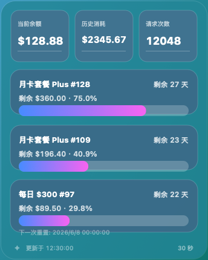

# HyperAPI Account Monitor / HyperAPI 余额监控



> 中文说明在前，English version follows.

## 中文

HyperAPI Account Monitor 是一个个人用的 HyperAPI 余额与订阅套餐监控工具。它可以通过 HyperAPI 的用户接口读取当前余额、历史消耗、请求次数以及订阅套餐剩余额度，并在 macOS 桌面上显示一个常驻悬浮窗。

### 当前状态

- 仅在 `https://hyperapi.cc` 上测试成功。
- macOS 悬浮窗只支持 macOS。
- 其他系统用户可以复用本项目的 shell 脚本获取余额/订阅信息，再自行开发对应平台的 UI。
- 项目目前是个人原型，不保证兼容所有 NewAPI/New API 部署站点。

### 功能

- 使用账号密码初始化一次，生成系统 access token。
- 将 access token 保存到 macOS Keychain。
- 后续刷新直接使用 Keychain token，不需要每次登录。
- macOS 桌面常驻悬浮窗。
- 支持将 macOS 悬浮窗加入登录项，实现开机登录后自启。
- 菜单栏状态项可配置显示内容：
  - 当前余额
  - 历史消耗
  - 请求次数
  - 某个订阅的剩余额度
  - 某个订阅的剩余百分比
- 悬浮窗可配置展示订阅数量。
- 默认只展示未过期且未用完的订阅。
- 可手动隐藏某个仍有效的订阅。
- 订阅按编号从大到小展示。
- 当订阅用完或过期后，刷新时会自动从悬浮窗中消失。
- 支持刷新频率：10 秒、30 秒、1 分钟、5 分钟。
- 支持余额/订阅消耗淡出特效，可在菜单栏设置中开关。

### 运行环境

macOS 桌面悬浮窗需要：

- macOS
- Swift 6 或可用的 Apple Swift 工具链
- macOS Keychain

命令行脚本需要：

- `bash`
- `curl`
- `jq`
- macOS Keychain 相关脚本需要 `security` 命令

### 快速开始

1. 复制环境变量模板：

```bash
cp .env.example .env
```

2. 编辑 `.env`：

```bash
HYPERAPI_BASE_URL=https://hyperapi.cc
HYPERAPI_USERNAME=your_username_or_email
HYPERAPI_PASSWORD=your_password
```

如果账号启用了 2FA，可以临时填写：

```bash
HYPERAPI_2FA_CODE=123456
```

3. 初始化 Keychain token：

```bash
./scripts/setup-hyperapi-token.sh
```

注意：该脚本会调用 HyperAPI 的 `GET /api/user/token` 生成新的系统 access token。重复运行可能使旧 access token 失效。

4. 测试命令行抓取：

```bash
./scripts/fetch-hyperapi-token.sh
```

5. 启动 macOS 悬浮窗：

```bash
swift run NewAPIAccountMonitor
```

开发时也可以构建临时 `.app` 后运行，项目当前手动打包路径为：

```bash
build/NewAPIAccountMonitor.app
```

### 详细使用方法

#### 1. 安装依赖

确认本机已经安装 Swift 工具链、`curl` 和 `jq`：

```bash
swift --version
curl --version
jq --version
```

如果缺少 `jq`，可以通过 Homebrew 安装：

```bash
brew install jq
```

#### 2. 创建本地配置

复制 `.env.example` 为 `.env`，然后填写你自己的 HyperAPI 账号信息：

```bash
cp .env.example .env
```

`.env` 至少需要包含：

```bash
HYPERAPI_BASE_URL=https://hyperapi.cc
HYPERAPI_USERNAME=your_username_or_email
HYPERAPI_PASSWORD=your_password
```

如果你的站点不是 `https://hyperapi.cc`，可以修改 `HYPERAPI_BASE_URL`，但请注意本项目目前只在 HyperAPI 官方站点测试成功。

#### 3. 首次初始化 token

运行 setup 脚本：

```bash
./scripts/setup-hyperapi-token.sh
```

脚本会完成这些动作：

- 使用 `.env` 里的账号密码登录一次。
- 调用 HyperAPI 接口生成系统 access token。
- 把 access token 存入 macOS Keychain。
- 自动把 `HYPERAPI_USER_ID` 写回 `.env`。

初始化成功后，终端会提示 token 已保存到 Keychain。后续日常刷新不再需要读取账号密码，也不需要每次登录。

#### 4. 命令行查看余额和订阅

初始化完成后，运行：

```bash
./scripts/fetch-hyperapi-token.sh
```

脚本会输出：

- 当前余额
- 历史消耗
- 请求次数
- 订阅套餐名称
- 订阅编号
- 剩余天数和到期时间
- 总额度、已用额度、剩余额度和进度百分比
- 每日套餐的下一次重置时间

如果只是想调试登录流程，也可以使用：

```bash
./scripts/fetch-hyperapi-login.sh
```

这个脚本会每次都用账号密码登录，不建议作为日常刷新方式。

#### 5. 启动 macOS 桌面悬浮窗

运行：

```bash
swift run NewAPIAccountMonitor
```

启动后会出现两个部分：

- 桌面悬浮窗：常驻显示余额和订阅套餐进度。
- macOS 菜单栏状态项：点击后打开设置面板。

悬浮窗默认处于桌面底层，不遮挡普通应用窗口。需要移动位置时，在菜单栏设置里开启定位模式，拖动完成后再锁定位置。

如果需要开机登录后自动启动，请先从 `.app` 启动应用，再在菜单栏设置中开启“开机自启”。使用 `swift run NewAPIAccountMonitor` 启动时通常没有完整应用包，macOS 可能无法把它注册为登录项。

#### 6. 使用菜单栏设置

点击 macOS 顶部菜单栏中的状态项，可以打开设置面板。设置面板支持：

- 手动刷新数据。
- 选择菜单栏显示内容：当前余额、历史消耗、请求次数、某个订阅剩余额度或某个订阅剩余百分比。
- 设置悬浮窗展示的订阅数量。
- 设置自动刷新频率：10 秒、30 秒、1 分钟、5 分钟。
- 开关开机自启。
- 开关余额/订阅消耗淡出特效。
- 进入或退出悬浮窗定位模式。
- 对仍有效且未用完的订阅，单独选择是否在悬浮窗中展示。

已经过期或已经用完的订阅默认不展示，也不会出现在可选展示开关里。订阅会按编号从大到小排序；如果某个订阅刷新后用完或过期，会自动从悬浮窗消失。

#### 7. 更新账号或重新授权

如果你修改了账号密码、切换账号，或 Keychain token 失效，重新运行：

```bash
./scripts/setup-hyperapi-token.sh
```

注意：HyperAPI 的系统 access token 可能一次只保留最新生成的 token。重复运行 setup 脚本可能导致旧 token 失效。

#### 8. 非 macOS 用户如何使用

非 macOS 系统无法使用本项目的 SwiftUI 桌面悬浮窗和 macOS Keychain 集成，但仍可以参考 shell 脚本里的接口流程：

- 登录接口：`POST /api/user/login`
- 用户信息：`GET /api/user/self`
- 订阅信息：`GET /api/subscription/self`
- 套餐计划：`GET /api/subscription/plans`
- token 初始化：`GET /api/user/token`

其他系统用户可以基于这些脚本改造自己的凭据存储方式和桌面 UI。

#### 9. 常见问题

如果提示缺少 `jq`，安装 `jq` 后重试。

如果提示 Keychain 中没有 token，先运行 `./scripts/setup-hyperapi-token.sh`。

如果登录失败，检查 `.env` 中的站点地址、用户名、密码和 2FA 验证码。

如果站点启用了 Cloudflare Turnstile，纯命令行登录可能无法完成，需要额外处理人工验证。

如果悬浮窗没有数据，先运行 `./scripts/fetch-hyperapi-token.sh` 确认命令行抓取是否正常。

如果“开机自启”提示需要允许，请打开 macOS“系统设置 > 通用 > 登录项”，允许 NewAPIAccountMonitor 作为登录项运行。

### 菜单栏与悬浮窗

macOS 顶部区域通常称为菜单栏。本项目会在菜单栏中显示一个状态项。点击状态项后显示设置面板，而不是重复显示悬浮窗。

设置面板中可以：

- 刷新数据。
- 设置菜单栏显示内容。
- 设置悬浮窗展示订阅数量。
- 设置刷新频率。
- 开关消耗淡出特效。
- 进入/退出悬浮窗定位模式。
- 选择隐藏某些未过期且未用完的订阅。

悬浮窗默认位于桌面层级，不遮挡其他窗口。进入定位模式后可以用鼠标拖动位置；锁定后回到底层。

### 配置项

`.env.example` 中包含可用配置：

```bash
HYPERAPI_BASE_URL=https://hyperapi.cc
HYPERAPI_USERNAME=your_username_or_email
HYPERAPI_PASSWORD=your_password
HYPERAPI_USER_ID=123
HYPERAPI_KEYCHAIN_SERVICE=newapi-account-scraper.hyperapi
HYPERAPI_2FA_CODE=123456
HYPERAPI_TURNSTILE_TOKEN=
HYPERAPI_HIDE_EXHAUSTED=false
HYPERAPI_INCLUDE_ALL_SUBSCRIPTIONS=true
HYPERAPI_WIDGET_X=38
HYPERAPI_WIDGET_Y=240
HYPERAPI_WIDGET_WIDTH=344
HYPERAPI_WIDGET_HEIGHT=430
```

真实 `.env` 不应提交到仓库。

### 脚本说明

- `scripts/setup-hyperapi-token.sh`
  - 用账号密码登录一次。
  - 生成系统 access token。
  - 保存 token 到 macOS Keychain。
  - 写入 `HYPERAPI_USER_ID` 到 `.env`。

- `scripts/fetch-hyperapi-token.sh`
  - 从 Keychain 读取 token。
  - 抓取余额、历史消耗、请求次数和订阅信息。
  - 推荐日常使用。

- `scripts/fetch-hyperapi-login.sh`
  - 每次运行都用账号密码登录并抓取数据。
  - 主要用于调试或 token 初始化失败时排查。

- `scripts/verify-hyperapi.sh`
  - 可从 HAR 或环境变量读取请求信息，验证接口字段。
  - 适合调试接口变化。

### 安全说明

本项目不会提交真实 `.env`、HAR 抓包文件、Keychain token、Cookie、API Key 或证书文件。`.gitignore` 已忽略：

- `.env`
- `.env.*`
- `captures/`
- `*.har`
- 常见私钥/证书文件
- Swift/Xcode/Node 构建产物

开源前建议再次运行：

```bash
git status --short --ignored
git check-ignore -v .env captures/hyperapi.cc.har
rg -n -i --glob '!captures/**' --glob '!.env' '(password|secret|token|authorization|cookie|api[_-]?key|bearer|sk-)'
```

请不要把真实账号密码、access token、API Key、Cookie、HAR 文件提交到 GitHub。

### 已知限制

- 仅对 HyperAPI 测试成功。
- macOS 悬浮窗仅支持 macOS。
- 开机自启依赖 macOS 登录项，需要从 `.app` 启动，并且应用需要可被系统接受的代码签名。
- 其他 NewAPI/New API 部署可能字段、鉴权方式或接口路径不同。
- 如果站点启用 Cloudflare Turnstile，纯脚本登录可能需要额外人工验证。
- 当前 `.app` 打包方式仍是开发期临时方案，正式发布还需要补充签名、图标、版本号和安装流程。

### 开发命令

```bash
swift build
bash -n scripts/*.sh
./scripts/fetch-hyperapi-token.sh
swift run NewAPIAccountMonitor
```

## English

HyperAPI Account Monitor is a personal HyperAPI balance and subscription monitor. It reads account balance, historical usage, request count, and subscription quota from HyperAPI user APIs, then displays the information in a persistent macOS desktop floating widget.

### Current Status

- Successfully tested only with `https://hyperapi.cc`.
- The desktop floating widget supports macOS only.
- Users on other operating systems can reuse the shell scripts to fetch account data and build their own UI.
- This is currently a personal prototype and is not guaranteed to work with every NewAPI/New API deployment.

### Features

- One-time username/password setup to generate a system access token.
- Stores the access token in macOS Keychain.
- Subsequent refreshes use the Keychain token without logging in again.
- Persistent macOS desktop floating widget.
- Configurable menu bar status text:
  - Current balance
  - Historical usage
  - Request count
  - Remaining amount of a selected subscription
  - Remaining percentage of a selected subscription
- Configurable number of subscriptions shown in the widget.
- Shows only non-expired and non-exhausted subscriptions by default.
- Allows hiding specific still-valid subscriptions.
- Sorts subscriptions by subscription ID descending.
- Automatically removes a subscription from the widget after it expires or is exhausted.
- Supports refresh intervals: 10 seconds, 30 seconds, 1 minute, and 5 minutes.
- Supports a red fade-out consumption effect when balance or subscription quota decreases.

### Requirements

The macOS floating widget requires:

- macOS
- Swift 6 or a compatible Apple Swift toolchain
- macOS Keychain

The shell scripts require:

- `bash`
- `curl`
- `jq`
- The macOS `security` command for Keychain-based scripts

### Quick Start

1. Copy the environment template:

```bash
cp .env.example .env
```

2. Edit `.env`:

```bash
HYPERAPI_BASE_URL=https://hyperapi.cc
HYPERAPI_USERNAME=your_username_or_email
HYPERAPI_PASSWORD=your_password
```

If your account has 2FA enabled, temporarily set:

```bash
HYPERAPI_2FA_CODE=123456
```

3. Initialize the Keychain token:

```bash
./scripts/setup-hyperapi-token.sh
```

Note: this script calls HyperAPI's `GET /api/user/token` endpoint to generate a new system access token. Running it again may invalidate the previous access token.

4. Test CLI fetching:

```bash
./scripts/fetch-hyperapi-token.sh
```

5. Start the macOS widget:

```bash
swift run NewAPIAccountMonitor
```

### Detailed Usage

#### 1. Install Dependencies

Make sure Swift, `curl`, and `jq` are available:

```bash
swift --version
curl --version
jq --version
```

If `jq` is missing, install it with Homebrew:

```bash
brew install jq
```

#### 2. Create Local Configuration

Copy `.env.example` to `.env`, then fill in your own HyperAPI account:

```bash
cp .env.example .env
```

At minimum, `.env` should contain:

```bash
HYPERAPI_BASE_URL=https://hyperapi.cc
HYPERAPI_USERNAME=your_username_or_email
HYPERAPI_PASSWORD=your_password
```

You may change `HYPERAPI_BASE_URL` for a different deployment, but this project has only been tested successfully with HyperAPI.

#### 3. Initialize the Token Once

Run the setup script:

```bash
./scripts/setup-hyperapi-token.sh
```

The script will:

- Log in once using the username and password from `.env`.
- Generate a system access token through HyperAPI.
- Store the access token in macOS Keychain.
- Write `HYPERAPI_USER_ID` back to `.env`.

After setup succeeds, normal refreshes use the Keychain token and do not need to log in every time.

#### 4. Check Balance and Subscriptions from CLI

After token setup, run:

```bash
./scripts/fetch-hyperapi-token.sh
```

The script prints:

- Current balance
- Historical usage
- Request count
- Subscription names
- Subscription IDs
- Remaining days and expiration time
- Total quota, used quota, remaining quota, and progress percentage
- Next reset time for daily-reset subscriptions

For login debugging, you can run:

```bash
./scripts/fetch-hyperapi-login.sh
```

This script logs in with username/password on every run, so it is not recommended for daily refreshes.

#### 5. Start the macOS Desktop Widget

Run:

```bash
swift run NewAPIAccountMonitor
```

The app creates:

- A desktop floating widget for balance and subscription progress.
- A macOS menu bar status item that opens the settings panel.

The floating widget stays at the desktop level by default and does not cover normal app windows. To move it, enable positioning mode from the menu bar settings, drag it, then lock it again.

#### 6. Use Menu Bar Settings

Click the menu bar status item to open settings. From the settings panel you can:

- Refresh data manually.
- Choose what the menu bar shows: current balance, historical usage, request count, remaining amount of a selected subscription, or remaining percentage of a selected subscription.
- Set how many subscriptions the floating widget displays.
- Set the auto-refresh interval: 10 seconds, 30 seconds, 1 minute, or 5 minutes.
- Enable or disable the balance/subscription consumption fade-out effect.
- Enter or exit widget positioning mode.
- Hide or show specific subscriptions that are still valid and not exhausted.

Expired or exhausted subscriptions are hidden by default and are not offered as show/hide options. Subscriptions are sorted by ID descending. If a subscription becomes exhausted or expires after refresh, it is automatically removed from the widget.

#### 7. Update Account or Reauthorize

If you change password, switch accounts, or the Keychain token expires, run setup again:

```bash
./scripts/setup-hyperapi-token.sh
```

Note: HyperAPI may keep only the latest generated system access token. Running setup again may invalidate the previous token.

#### 8. Usage on Non-macOS Systems

The SwiftUI floating widget and macOS Keychain integration are macOS-only. Other operating systems can still use the shell scripts as a reference for the data flow:

- Login: `POST /api/user/login`
- User data: `GET /api/user/self`
- Subscription data: `GET /api/subscription/self`
- Subscription plans: `GET /api/subscription/plans`
- Token setup: `GET /api/user/token`

Users on other systems can adapt the scripts with their own credential storage and UI.

#### 9. Troubleshooting

If `jq` is missing, install it and retry.

If the script says the Keychain token is missing, run `./scripts/setup-hyperapi-token.sh` first.

If login fails, check the base URL, username, password, and 2FA code in `.env`.

If the site enables Cloudflare Turnstile, pure command-line login may need additional manual verification.

If the widget shows no data, first run `./scripts/fetch-hyperapi-token.sh` to confirm CLI fetching works.

### Menu Bar and Floating Widget

The app creates a macOS menu bar status item. Clicking it opens a settings panel, not a duplicate copy of the floating widget.

From the settings panel you can:

- Refresh data.
- Choose what the menu bar shows.
- Set how many subscriptions the floating widget displays.
- Change the refresh interval.
- Enable or disable the consumption fade-out effect.
- Enter or exit widget positioning mode.
- Hide specific non-expired and non-exhausted subscriptions.

The floating widget stays at the desktop level by default and does not cover normal app windows. Positioning mode temporarily makes it draggable; locking it returns it to the desktop layer.

### Configuration

See `.env.example` for all available options:

```bash
HYPERAPI_BASE_URL=https://hyperapi.cc
HYPERAPI_USERNAME=your_username_or_email
HYPERAPI_PASSWORD=your_password
HYPERAPI_USER_ID=123
HYPERAPI_KEYCHAIN_SERVICE=newapi-account-scraper.hyperapi
HYPERAPI_2FA_CODE=123456
HYPERAPI_TURNSTILE_TOKEN=
HYPERAPI_HIDE_EXHAUSTED=false
HYPERAPI_INCLUDE_ALL_SUBSCRIPTIONS=true
HYPERAPI_WIDGET_X=38
HYPERAPI_WIDGET_Y=240
HYPERAPI_WIDGET_WIDTH=344
HYPERAPI_WIDGET_HEIGHT=430
```

Never commit your real `.env`.

### Scripts

- `scripts/setup-hyperapi-token.sh`
  - Logs in once with username/password.
  - Generates a system access token.
  - Stores the token in macOS Keychain.
  - Writes `HYPERAPI_USER_ID` to `.env`.

- `scripts/fetch-hyperapi-token.sh`
  - Reads the token from Keychain.
  - Fetches balance, historical usage, request count, and subscription data.
  - Recommended for daily use.

- `scripts/fetch-hyperapi-login.sh`
  - Logs in with username/password every time and fetches data.
  - Useful for debugging or when token setup fails.

- `scripts/verify-hyperapi.sh`
  - Verifies endpoint structure using HAR-derived data or environment variables.
  - Useful when debugging API changes.

### Security Notes

This repository is configured to avoid committing real local secrets. `.gitignore` excludes:

- `.env`
- `.env.*`
- `captures/`
- `*.har`
- common private key and certificate files
- Swift/Xcode/Node build artifacts

Before publishing, run:

```bash
git status --short --ignored
git check-ignore -v .env captures/hyperapi.cc.har
rg -n -i --glob '!captures/**' --glob '!.env' '(password|secret|token|authorization|cookie|api[_-]?key|bearer|sk-)'
```

Do not publish real usernames, passwords, access tokens, API keys, cookies, or HAR files.

### Known Limitations

- Successfully tested only with HyperAPI.
- The floating widget is macOS-only.
- Other NewAPI/New API deployments may use different fields, authentication, or endpoint paths.
- If the site enables Cloudflare Turnstile, pure script login may require additional manual verification.
- The current `.app` packaging is still development-only. A production release needs signing, icon assets, versioning, and an installer/update flow.

### Development Commands

```bash
swift build
bash -n scripts/*.sh
./scripts/fetch-hyperapi-token.sh
swift run NewAPIAccountMonitor
```
